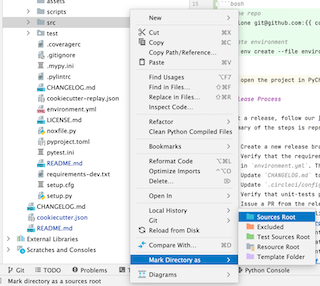

# Simple Ciphers in Python

This Repo contains python implementations of simple (hand-solvable) ciphers. This is not intended to be used for serious crytography, but rather to make fun (and solvable) puzzles.

<!-- TODO: add details about the project here -->

It contains several components:
- The **pycipher** package
- A CI configuration

# Developing

To start development on this project, clone the repository using git, and then create a conda environment for local 
development:
```bash
# clone repo
git clone git@github.com:davidlibland/pycipher

# create environment
conda env create --file environment.yml
conda activate pycipher-dev
```
Then, open the project in PyCharm, and mark the `src` directory as 'Sources' to enable autocomplete to work. After that,
add the newly created conda environment to PyCharm as the project interpreter. 



Our development guidelines require that the CI suite/unit tests pass. You can check that it is passing locally by
running it manually:
```bash
nox -db conda
```
This command will create conda environments for each component of the CI suite; this takes a while. To run only one
particular step, you can select it using the `-s` flag:
```bash
# run the tests session using python 3.9
nox -db conda -s tests-3.9
```
The currently available sessions are:
- requirements
- black
- isort
- lint
- mypy 
- tests

Each session may be run with a particular python version in {3.7, 3.8, 3.9}.

## Release Process

We use the `CHANGELOG.md` file to describe all major changes.  To cut a release, follow [DiGenesis Release Process].
The version scheme we use is based on CalVer and is described in the [Version Conventions] document.

## References

- This project was built from [cookiecutter-template] using the parameters in `cookiecutter-replay.json`. See
[cookiecutter-replay] for details on using this file to replay template generation.

[development-guidelines]: https://docs.google.com/document/d/19Tm6HGaelnKTI8GNvY44X4s7uxCq32cnuLyIBA9oRPo
[cookiecutter-replay]: https://cookiecutter.readthedocs.io/en/1.7.2/advanced/replay.html